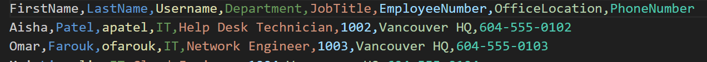
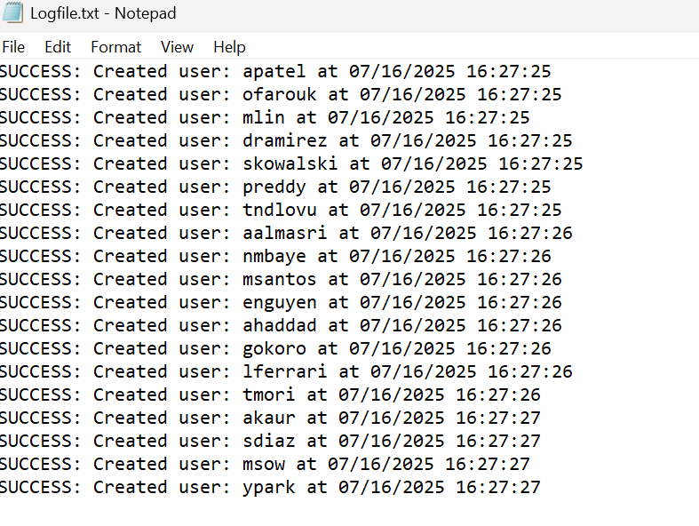

# 👥 Active Directory Account Creation (Windows Server Lab)

This script automates the creation of user accounts in Active Directory using a CSV file. It’s designed for IT administrators who need to bulk-create users quickly and consistently.

---

## ⚙️ What It Does: 
- Reads user data from a file called `Employees.csv`
- Creates Active Directory users with:
- First Name, Last Name, Username, Department, Job Title, and Password
- Sets the user password
- Adds users to an AD group based on their department
- Forces users to change their password at next login

### CSV Format
The `Employees.csv` file must include the following columns:

FirstName,LastName,Username,Password,Department,JobTitle

---

## 📝 How to Use This (Tested in Lab)

1. Place `powershell-ad.ps1` and `Employees.csv` in the same folder.
2. Open PowerShell as Administrator.
3. Run the script:

    .\powershell-ad.ps1

## 📸 The Log File will show if the users were created successfully. 

Requirements:
- Must run on a machine connected to an Active Directory domain
- PowerShell 5.1 or newer
- Active Directory PowerShell module installed
- Appropriate permissions to create users and manage groups

--- 

Note:
Make sure your CSV is correctly formatted before running the script.
