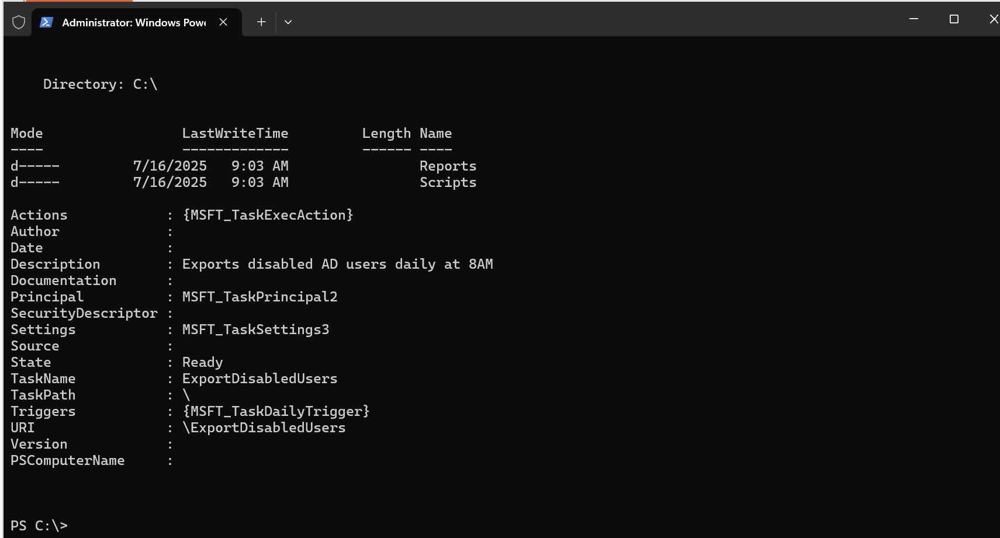

# Export-Disabled-Accounts
This PowerShell automation project exports a list of all disabled Active Directory users to a local `.csv` report once per day using Windows Task Scheduler.

## ⚙️ What It Does

Uses PowerShell to:
- Query all disabled Active Directory users  
- Export user details to a `.csv` file in `C:\Reports`  
- Create that folder automatically if it doesn’t exist  

Uses Windows Task Scheduler to:
- Run the script **automatically every day at 9:00 AM**
- Run the task under the **SYSTEM account** with highest privileges

## 📝 How to Use This (Tested in Lab)

Run the one-time setup script: Create-ScheduledTask.ps1. This will:
- Create required folders: C:\Scripts\ and C:\Reports\
- Register a scheduled task called ExportDisabledUsers
- Set it to run daily at 9:00 AM using the SYSTEM account

<pre> powershell powershell.exe -ExecutionPolicy Bypass -File ".\Create-ScheduledTask.ps1" </pre>

You should see a confirmation message in PowerShell that the task has been registered.
## 📸 Screenshot: Powershell Script Running

Once the task runs, check this folder for your output:

`C:\Reports\DisabledUsers_YYYY-MM-DD.csv`

## 📸 Inside the Report Folder

It will contain a list of all disabled users in your Active Directory.

## 📸 Output of Report File

