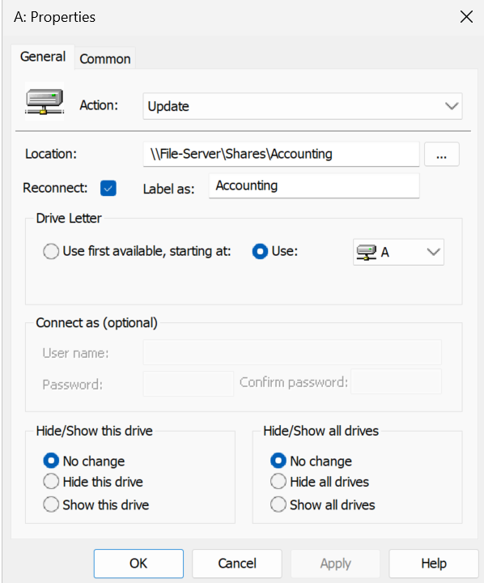
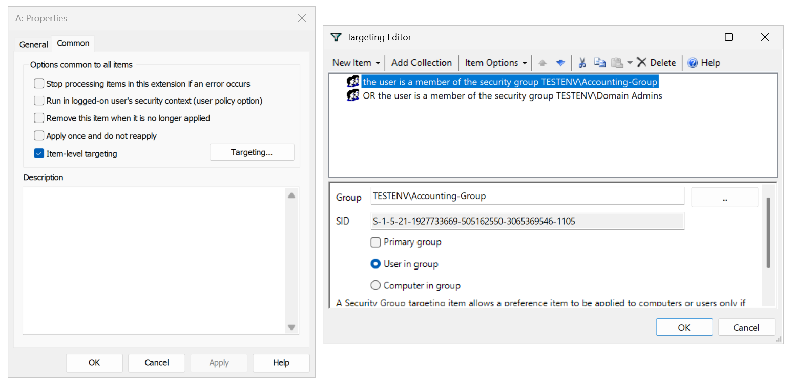

# 📁 File Server & Access Management (Windows Server Lab)

This lab demonstrates how to set up and manage a secure file server in a Windows Server domain environment using automation, NTFS permissions, Group Policy, and PowerShell scripting.

Simulates real-world Tier 2 System Administrator responsibilities.

---

## Lab Environment

| Component         | Name                         |
|------------------|------------------------------|
| Domain Name       | `test-env.local`             |
| File Server       | `file-server.test-env.local` |
| Domain Controller | `dc-controller.test-env.local` |
| Clients           | Windows 10/11 workstations   |
| Groups            | `hr-group`, `it-group`, `accounting-group` |

---

### 1️⃣ Prepare Shared Folder on File Server

- Create `C:\Shares` on the file server manually.
- Right-click → **Properties → Sharing → Advanced Sharing**
- Share the folder with **Everyone – Full Control**

> ⚠️ **Security Note:**\
> Although the share is open to "Everyone," access is strictly controlled using **NTFS permissions** for each subfolder (set in the script below).

📸  
(images/permissions_for_shared_folder.png)

---

### 2️⃣ Run `create_folders.ps1` (Folder Creation + NTFS)

- Creates three subfolders inside `D:\Shares`:
  - `Accounting`, `IT`, `HR`
- Applies NTFS permissions:
  - `Domain Admins`: Full Control
  - Department group (e.g., `hr-group`): Modify
- Creates and shares each folder over the network

📜 NTFS Permissions Applied:
| Folder     | Group          | Rights       |
|------------|----------------|--------------|
| HR         | `hr-group`     | Modify       |
| IT         | `it-group`     | Modify       |
| Accounting | `accounting-group` | Modify  |
| All folders | `Domain Admins` | Full Control |

📸  

> 🛠️ Run as Administrator on the file server  
> 🔐 Least privilege access enforced via NTFS

---

### 3️⃣ Create GPO for Drive Mapping

- Open **Group Policy Management Console**
- Create GPO: `Map_Department_Shares`
- Under: `User Configuration > Preferences > Windows Settings > Drive Maps`

For each department:
- Map a network drive (e.g., H:\ for HR)
- Use **Item-Level Targeting** to assign based on group membership

📸 
 

---

### 4️⃣ Run `folder_report.ps1` (Create Audit Report)

- Scans subfolders under `C:\Shares`
- Exports NTFS permissions into a CSV
- Fields include: `IdentityReference`, `AccessControlType`, `Rights`

📸  

---

### View Final Report of NTFS Permissions (Audit Report)

## ✅ Summary: What This Project Demonstrates

- NTFS & Share permissions separation for layered security
- PowerShell automation for consistent access setup
- Drive mapping automation using Group Policy & targeting
- Auditing folder access for security review

---

## 🧰 Tools Used

- Windows Server 2019/2022
- Active Directory Domain Services
- Group Policy Management Console
- PowerShell 5.1+
- Hyper-V (local test lab)

---

## 🧠 Skills Practiced

- File server configuration
- NTFS and Share access control
- PowerShell scripting for automation
- GPO creation and item-level targeting
- Security permission auditing

---

