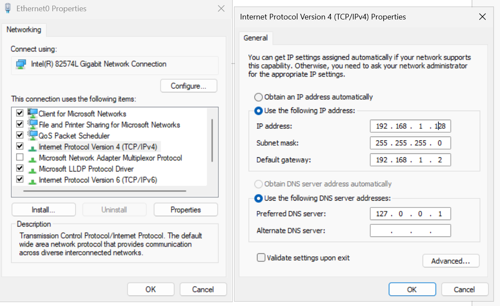
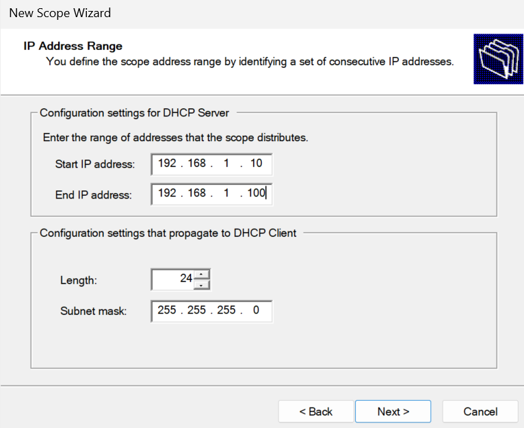
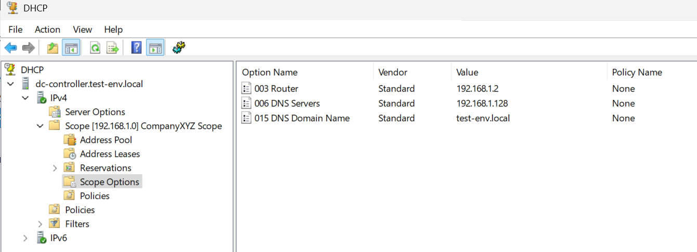
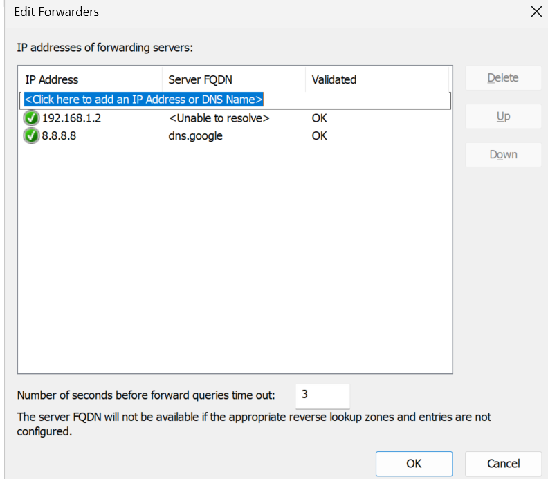
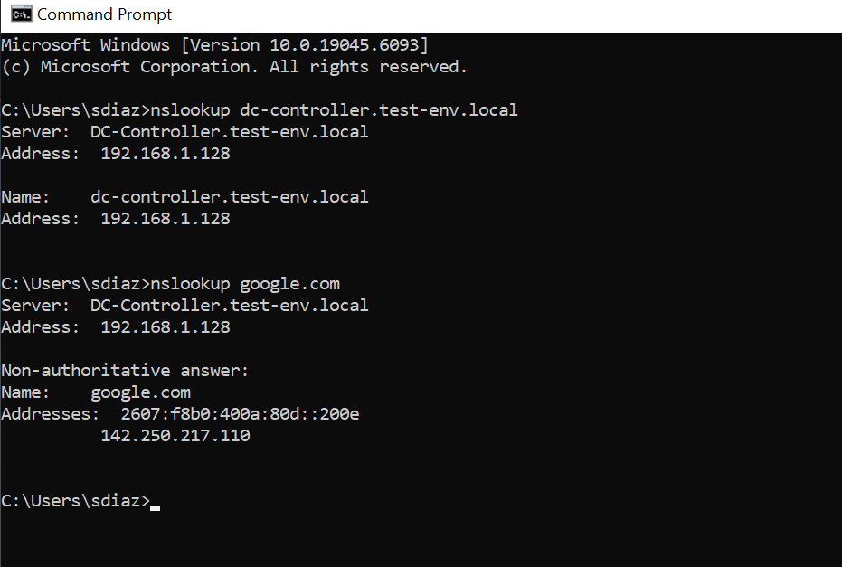
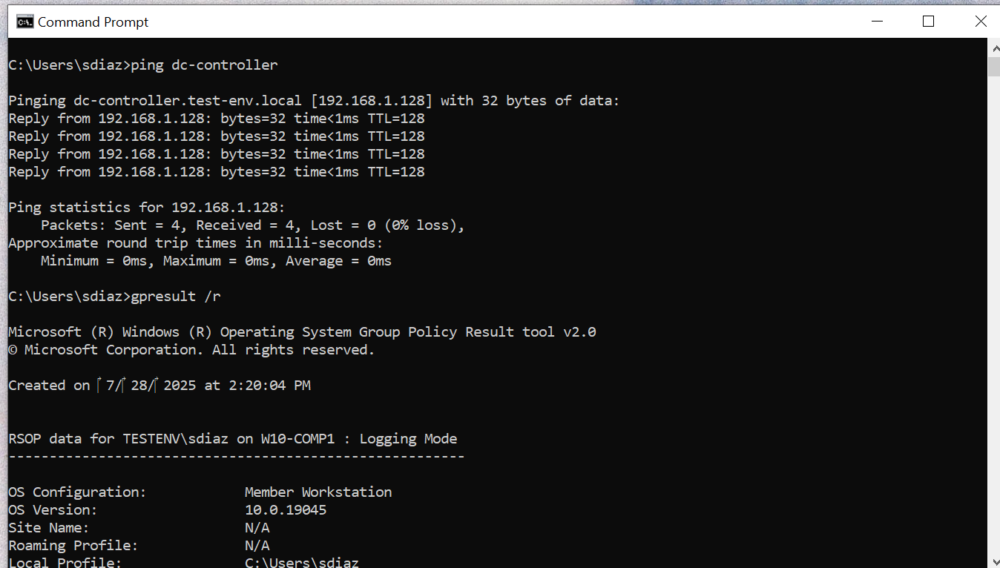
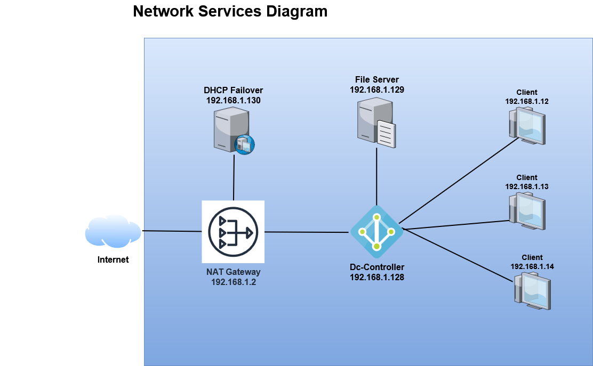

# 🛜 Network Services Lab – Active Directory, DHCP & DNS

This lab demonstrates how to configure core network infrastructure services in a Windows Server domain environment, including **Active Directory**, **DHCP**, and **DNS**. It simulates a realistic enterprise setup with domain-joined Windows clients using dynamically assigned IPs and internal name resolution.

---

## Lab Environment

| Component         | Hostname                      | IP Address       | Notes                          |
|------------------|-------------------------------|------------------|--------------------------------|
| Domain Controller| dc-controller.test-env.local  | 192.168.1.128    | Hosts AD DS, DHCP, DNS         |
| File Server      | file-server.test-env.local    | 192.168.1.129    | Member server, domain-joined   |
| Clients          | Win10/Win11 workstations       | 192.168.1.10–100 | Joined to domain               |
| Domain Name      | test-env.local                 | -                |                                |
| Network Adapter  | NAT (VMware VMnet8)            | 192.168.1.0/24   | DHCP Server Gateway: 192.168.1.2 |

---

## Services Configured

### 1️⃣ Active Directory Domain Services (AD DS)
- Promoted `dc-controller` to domain controller for `test-env.local`
- Created OUs for users, groups, and computers
- Joined client machines to the domain
- Set Static DHCP for DC-Controller 

📸 

---

### 2️⃣ DHCP Configuration (Role Installed on DC)
- Configured DHCP scope: `192.168.1.10–192.168.1.100`
📸 

- Set DHCP options:
  - Router (Option 3): `192.168.1.2`
  - DNS Server (Option 6): `192.168.1.128`
- Authorized DHCP in Active Directory
- Verified dynamic lease assignments

📸 

---

### 3️⃣ DHCP Failover Configuration
- Installed DHCP on a second server (`backup-dhcp.test-env.local`)
- Configured **Load Balance mode** for high availability
- Verified failover relationship and scope replication
- Simulated failover and confirmed clients could still lease IPs

---

### 4️⃣ DNS Configuration
- Verified AD-integrated DNS zone: `test-env.local`
- Created test A records for internal resolution
- Set up DNS forwarders to public DNS (e.g., 8.8.8.8)
📸 
- Verified resolution using `nslookup` from clients
📸 

---

## 🧪 Testing & Validation

- Clients automatically receive IP, gateway, and DNS from DC
- Clients can resolve internal hostnames: `ping dc-controller.test-env.local`
- Domain accounts can log in from any client
- GPOs apply correctly on domain-joined clients (`gpresult /r` verified)
- Remote resources (like file server) accessible via FQDN
- DHCP failover tested by disabling primary server

📸 

---

## 🧰 Tools Used

- **Windows Server 2025**
- **Windows 10/11 Clients**
- **Active Directory Domain Services**
- **DHCP Server Role**
- **DNS Server Role**
- **VMware Workstation (VMnet8 NAT)**

---

## Key Skills Demonstrated

- Domain Controller and Active Directory setup
- DHCP scope creation and lease management
- DHCP failover configuration with load balancing
- DNS zone configuration and internal resolution
- Domain joining and client/server communication
- Group Policy application validation
- Network troubleshooting with PowerShell & CLI tools

---

## 📊 Network Diagram

Below is a conceptual diagram of the lab setup:

📸 
