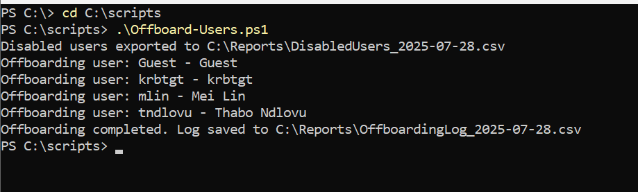
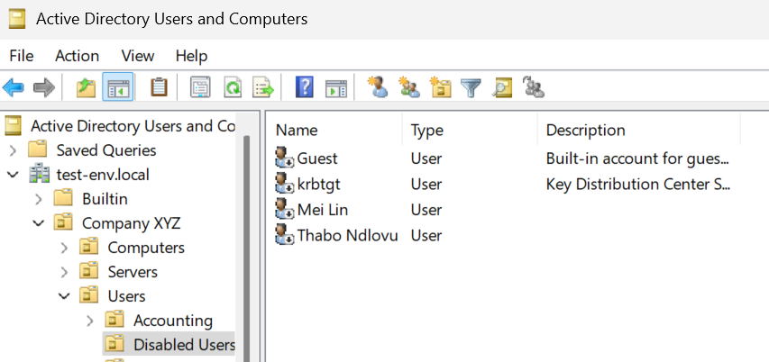
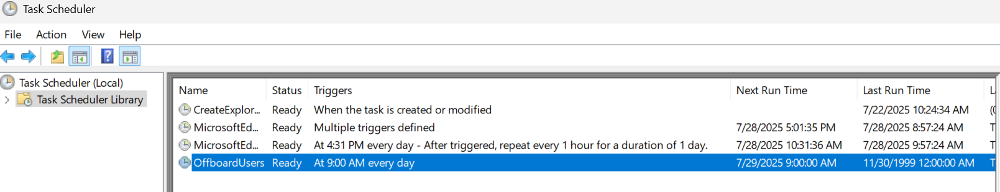
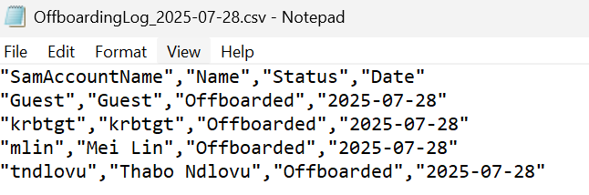

# 🚪 Active Directory Offboarding Automation

This lab demonstrates how to automate the offboarding process in an Active Directory environment using PowerShell and Task Scheduler. It mimics real-world Tier 2 System Administrator responsibilities such as deactivation, group cleanup, OU relocation, audit logging, and scheduled execution.

---

## 🧪 Lab Environment

| Component         | Example Name                    |
| ----------------- | ------------------------------- |
| Domain Name       | `test-env.local`                |
| Domain Controller | `dc-controller.test-env.local`  |
| User OU           | `OU=Users,OU=Company XYZ,...`   |
| Disabled OU       | `OU=DisabledUsers,OU=Users,...` |
| Groups            | `HR`, `IT`, `Sales`, etc.       |

---

### 1️⃣ Prepare Your AD Environment

Ensure the following OU structure exists in Active Directory:

```
OU=DisabledUsers,OU=Users,OU=Company XYZ,DC=test-env,DC=local
```

If not, create it using PowerShell:

```powershell
New-ADOrganizationalUnit -Name "DisabledUsers" -Path "OU=Users,OU=Company XYZ,DC=test-env,DC=local"
```

> 🛠️ You must run this with Domain Admin privileges.

---

### 2️⃣ Customize Script Variables

Ensure your scripts (`Offboard-Users.ps1` and `CreateScheduledTask.ps1`) use environment-specific paths:

```powershell
$RootDN = "OU=Company XYZ,DC=test-env,DC=local"
$UserOU = "OU=Users,$RootDN"
$disabledOU = "OU=DisabledUsers,$UserOU"
```

These variables define the base OU and the destination for disabled users.

---

### 3️⃣ Run the Offboarding Script Manually

1. Open PowerShell as Administrator
2. Navigate to your script directory
3. Run the script:

```powershell
.\Offboard-Users.ps1
```

*Note for best practices always ensure a few accounts are disabled so that the report will not be empty

#### What Happens:

- Finds disabled AD users
- Moves them to the `DisabledUsers` OU
- Removes them from all AD groups (except `Domain Users`)
- Clears `Department` and `Manager` attributes
- Logs each user to `C:\Reports\OffboardingLog_<date>.csv`

### Disabled User Report Output and Results
 

---

### 4️⃣ Automate Offboarding with Task Scheduler (occurs every day at 9AM)

1. Open PowerShell as Administrator
2. Navigate to your script directory
3. Run the script:

```powershell
.\Create-ScheduledTask.ps1
```

If done correctly, you should be able to see the Task in Task Scheduler: 


---

### 5️⃣ Validate Logs and Output

Navigate to `C:\Reports` and verify that two files are created:

- `DisabledUsers_<date>.csv`: Snapshot of currently disabled users
- `OffboardingLog_<date>.csv`: List of users successfully processed


> 📂 All reports are saved for auditing and review.

---

## ✅ Summary: What This Project Demonstrates

- PowerShell automation for AD offboarding
- AD group cleanup and attribute wiping
- OU management and logging
- Task Scheduler automation 
- Real-world reporting and audit practices

---

## 🛠️ Tools Used

- PowerShell 5.1+
- Active Directory Module for Windows PowerShell (RSAT)
- Task Scheduler
- Windows 10/11 or Windows Server (domain-joined)

---

## 🧠 Skills Practiced

- Active Directory lifecycle management
- PowerShell scripting and logging
- Scheduled automation
- Hands-on Tier 2 System Admin workflow simulation


