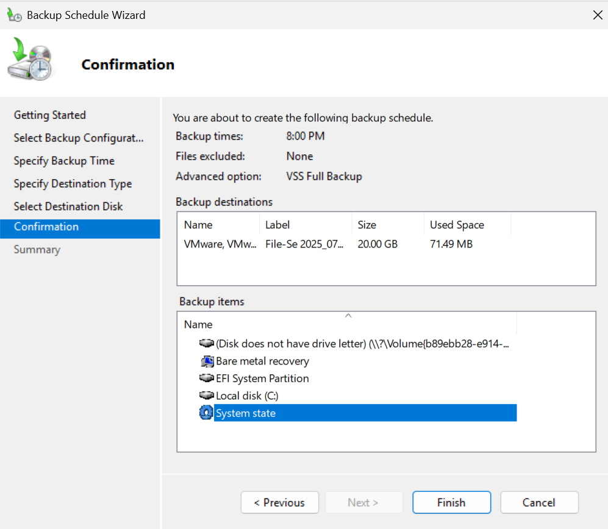

# 🛡️ Windows Security Hardening & Backup Strategy

This project demonstrates comprehensive Windows system administration skills: implementing enterprise security baselines through Group Policy, configuring automated backup strategies, and establishing ongoing security monitoring. Perfect for showcasing Tier 2 System Administrator capabilities in security compliance, disaster recovery planning, and operational monitoring in a domain environment.

---

## Lab Environment

| Component        | Value                         |
|------------------|-------------------------------|
| Domain Name      | test-env.local                |
| Domain Controller| dc-controller.test-env.local  |
| File Server      | file-server.test-env.local    |
| Clients          | Windows 10/11 (domain-joined) |
| Backup Target    | Secondary virtual disk (VHD)  |

---

### 1. Security Hardening (GPO)

A Group Policy Object (`Security-Baseline`) was applied to the **Workstations OU** to enforce standard security controls.

###  Key GPO Settings

| Category              | Settings                                                                 |
|-----------------------|--------------------------------------------------------------------------|
| **Account Policies**  | - Password min. length: 12 chars - Lockout after 5 failed attempts    |
| **Local Security**    | - Require Ctrl+Alt+Del at login - Enable UAC                          |
| **Network Access**    | - Disable guest account                                                  |
| **Remote Access**     | - Disable RDP by default - Enable Windows Defender Firewall           |

📁 *GPO Report is available in `/Reports/Security_Baseline.htm`*

### 🔐 Security Rationale

These settings protect against common attack vectors:
- **Strong passwords + lockout**: Prevents brute force and credential stuffing attacks
- **UAC + secure login**: Blocks privilege escalation and keylogger attacks  
- **Guest account disabled**: Eliminates unauthorized local access
- **RDP disabled + firewall**: Protects against ransomware and network intrusions

---

## 2. Windows Server Backup Configuration

The file server was configured for daily backups of:

- **System State** (for Active Directory recovery)  
- **Shared Data** (`C:\Shared` folder)

### 🛠️ Backup Settings

| Setting       | Value                          |
|---------------|--------------------------------|
| Tool Used     | Windows Server Backup (GUI)   |
| Schedule      | Daily at 8:00 PM              |
| Target Drive  | X:\Backup (mounted VHD)        |
| Backup Type   | Full volume + system state     |
| Retention     | 30 days (automatic cleanup)    |
| Monitoring    | Manual via Event Viewer        |

---

## ✅ 3. Backup Validation

**Steps Performed:**
- Confirmed backup job created in WSB  
- Verified completion via Event Viewer (Event ID 4)  
- Performed **manual file restore test**  
- Confirmed NTFS metadata and data integrity

---

## 4. Security Monitoring & Compliance

### Key Monitoring Activities (Event Viewer)

| Activity | Description | Screenshot |
|----------|-------------|------------|
| **Failed Login Analysis** | Monitored Security Event ID 4625 for brute force indicators |  |
| **Account Lockout Tracking** | Reviewed Event ID 4740 to validate lockout policy effectiveness |  |
| **Successful Login Monitoring** | Tracked Event ID 4624 for user authentication patterns and logon types |  |

---

## 🧠 Skills Demonstrated

- **Group Policy Management**: Applied security baselines using GPMC
- **Windows Server Backup**: Configured automated daily backup schedules  
- **System Validation**: Performed backup testing and recovery verification
- **Security Monitoring**: Analyzed Windows Event Logs for security indicators
- **Compliance Auditing**: Verified policy enforcement across domain environment
- **Risk Assessment**: Documented security controls and business justifications

---

## 🧰 Tools Used

- Windows Server 2025 (DC + File Server)  
- Windows Server Backup (GUI)  
- Group Policy Management Console (GPMC)  
- Event Viewer  
- NTFS Permissions (optional)  
- Hyper-V Virtual Lab

